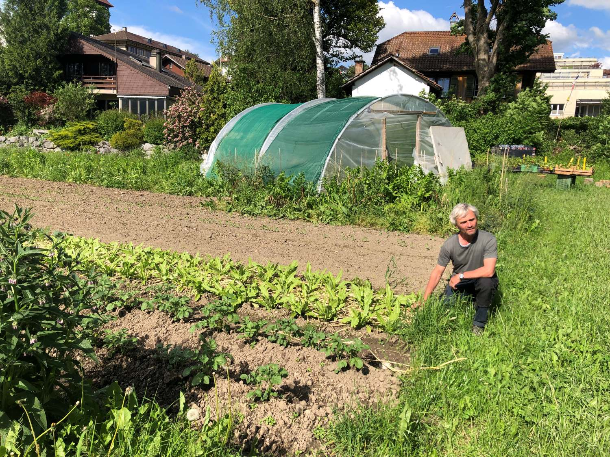
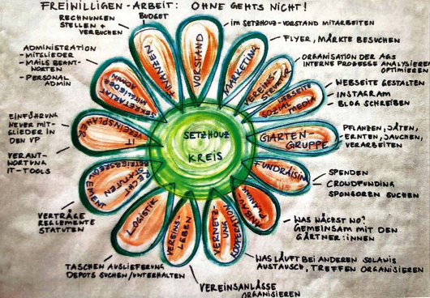
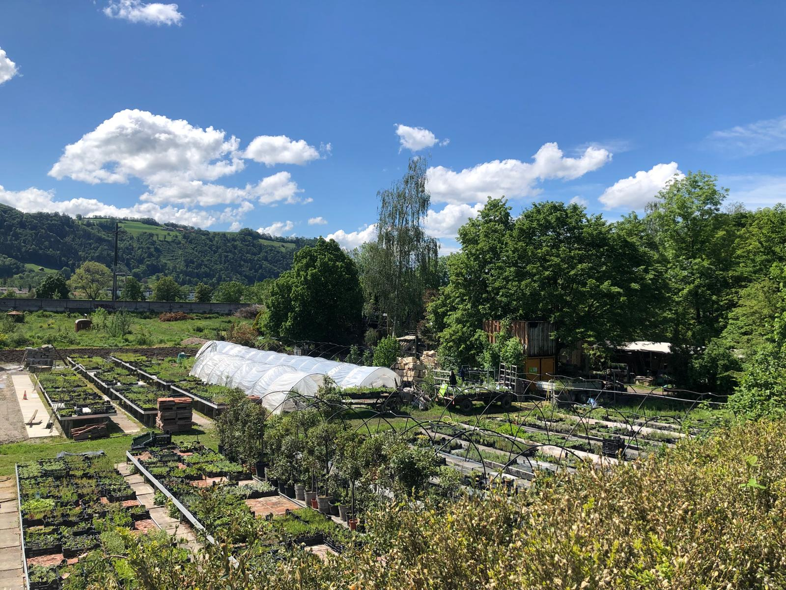

+++
title = "Solidarische Landwirtschaft – Das Versorgungsnetz der Zukunft?"
date = "2024-06-18"
draft = false
pinned = false
footnotes = "Solidarische Landwirtschaft - Das Versorgungsnetz der Zukunft?  **Von Erwan und Nora**"
+++
## *Nur 0.097% der Schweizer Landwirtschaftsbetriebe setzen heutzutage auf das System der solidarischen Landwirtschaft.*



Einer hat einen zweiten Arbeitsplatz, weil er bei der Solawi nicht genug verdient und der andere sorgt sich monatlich darum, ob sein Einkommen für den nächsten gesichert sein wird. Für beide steht das Prinzip des Kreislaufes sehr gross geschrieben. Die Interpretation unterscheidet sich allerdings deutlich.



<!--StartFragment-->

#### **Ein etwas anderer Hof**

<!--StartFragment-->

Die Nachricht erreicht uns, als wir verschwitzt von der unnötigen Hetzerei in den Zug stressen – Martin Huggenberger, Gärtner der solidarischen Landwirtschaft (abgekürzt Solawi) *Setzhouz* in Münsingen, wird sich um eine halbe Stunde verspäten. Der Grund für diesen Aufschub? Er ist noch an seinem Zweitarbeitsplatz beschäftigt. Die zusätzliche Zeit gibt uns die Gelegenheit, uns in Ruhe auf dem Grundstück der solidarischen Landwirtschaft umzusehen, die in der kleinen Stadt Münsingen, idyllisch eingebettet zwischen Thun und Bern, liegt.

Wer durch das überwucherte Eingangstor schlendert, wird in der fast schon idyllischen Stille kaum umhin kommen, das Informationsplakat zu lesen:

„Nach dem Prinzip der Solidarischen Landwirtschaft werden die Betriebskosten solidarisch auf die Mitglieder des Vereins aufgeteilt.“

Und noch spezifiziert wird das Ganze mit der Information, dass 25 Stunden Pro Jahr mitgearbeitet werden muss. Sei es auf dem Feld, bei der Administration oder mit einem höheren finanziellen Beitrag, jede Person kann entscheiden, wie sie mitmachen will (siehe unteres Bild). Ein weiterer wichtiger Aspekt der solidarischen Landwirtschaft ist die Idee der Vorfinanzierung. Jedes Mitglied muss beim Beitritt einen Anteil der Solawi erwerben und einen monatlich festen Betrag für die Gemüsetaschen bezahlen – unabhängig von der Höhe der Ernte. Somit wird den Landwirtinnen und Landwirte einen festen Lohn gesichert. Durch diesen können sie sich auf die Qualität der Produkte konzentrieren, neue Arten ausprobieren und andere anbauen, die sonst nicht rentabel wären. Somit wird der Druck abgebaut, unbedingt etwas erwirtschaften zu müssen.

Weiter hinten auf dem ein Hektar grossen Landfleck finden wir eine kleine Aufzucht für Setzlinge, einen kleinen Bagger ohne Vorderräder, eine Scheune mit eingebauter Küche und einen interessant riechenden Kompost direkt neben einem matschigen Weg, der in Richtung der Bahngleise führt.

<!--EndFragment-->

<!--StartFragment-->

#### Ein Weg bis hin zur Solawi

<!--StartFragment-->

Martin Huggenberger begann seine berufliche Laufbahn in der Landwirtschaft, einem Bereich, der ihn bis heute immer wieder anzieht.

Angefangen hat er auf einem konventionellen Landwirtschaftsbetrieb und berichtet wie er „den Druck, so viel wie möglich aus dem Boden herauszuwirtschaften, unerwartet stark zu spüren bekam, was mich kurzum überbelastet“ Was dann folgte war eine Umorientierung, die ihn in die sozialen Bereiche des Berufsmarktes trieb. Dass er heute bei einer solidarischen Landwirtschaft arbeitet, verbinde seine Lieblingselemente lückenlos,  wie er strahlend kommentiert.

Natürlich birgt jeder Traumberuf auch seine Tücken. Für Martin bestehen diese darin, dass es häufig langwierige Prozesse hervorrufen kann, wenn keine Hierarchien entstehen sollen, der Prozess transparent kommuniziert und auf alle eingegangen werden muss.

Am meisten Schwierigkeiten berge aber die Aufgabe alle Mitglieder und sich selbst immer wieder darauf zu besinnen, was anfänglich im Vordergrund stand und woran sich die Verwirklichung ihres Projektes zu orientieren hat.

<!--EndFragment-->

<!--StartFragment-->

#### Solawi eingebettet im Alltag

<!--StartFragment-->

Gemeinsam mit Kartoffeln, Karotten, etwas Öl und Gewürzen schmeckt die Pastinake am besten und erinnert geschmacklich an eine Mischung aus Karotte und Petersilie. Diese Entdeckung machte Andrea Grossmann, als sie vor einem Jahr neues Mitglied bei *Setzhouz* wurde. Nun lernt sie Gemüsesorten kennen, die in herkömmlichen Supermärkten schwer zu finden sind.

Einmal wöchentlich bringt ihre Tochter auf dem Heimweg von der Schule die Gemüsetasche mit, die nur wenige hundert Meter von ihrem Haus an einer Sammelstelle abgeholt wird, direkt in die Küche. Dort bereitet die Familie oft gemeinsam das Abendessen zu. Doch dieses Gemüse kommt nicht ohne eigenen Einsatz auf den Tisch. Jeden zweiten Samstag im Monat steht Andrea frühmorgens auf dem Dorfplatz in Münsingen, mitten im Trubel des Wochenmarktes. Hier beantwortet sie Fragen und wirbt neue Mitglieder für die Solidarische Landwirtschaft in Münsingen. Obwohl es eine anstrengende Aufgabe ist, findet Andrea sie auch bereichernd, da sie immer wieder in interessante Gespräche verwickelt wird.

#### Die Sache mit den Subventionen



Man könnte meinen, dass Solawi-Betriebe durch ihre solidarische und bodenschonende Arbeitsweise mehr Subventionen bekommen, als konventionelle Bauernhöfe. Im Falle des \*Setzhouzes\* ist aber das Gegenteil der Fall. Wegen ihrer Rechtsform (Verein) hat diese Solawi kein Anrecht auf Subventionen. Dass sie in eine solche Lage sind liegt daran, dass man, um eine Genossenschaft oder ein Betrieb  zu sein, ein Gebäude haben muss. Jedoch ist das für das \*Setzhouz\* am aktuellen Standort aus zwei Gründen nicht möglich. Zum einen, ironischerweise, wegen fehlender finanzieller Mittel und zum anderen aufgrund des Landschaftsschutzes. Trotz den fehlenden Subventionen überlebt das \*Setzhouz\* dank den  zahlreichen Mitgliedern, Darlehen und Spenden. Anders sieht es aus bei Hansueli Strahm aus, der einem konventionellen Betrieb führt. Subventionen bilden einen wichtiger Teil seiner Einnahmen wofür er teilweise seine Anbauweise verändert. Zum Beispiel hat er den Anteil an eingesetzten Pestiziden bei den Zuckerrüben drastisch verringert. Dafür wird er auch entsprechend vom Bund entschädigt. Auch für die Solarpanels auf dem Dach des Hofes gibt es Zuschüsse. Ein gezielter Einsatz von Subventionen wäre ein gutes Werkzeug. So würden Bäuerinnen und Bauern weniger Pestizide, Wasser und synthetische Düngemittel einsetzen und den Boden dabei übernutzen, da die anders erworbenen finanziellen Mittel dazu führen, dass auch eine leicht verringerte Ernte genug Einnahmen beschert. Betriebe würden so einen Anreiz finden,  ökologische Alternativen in Betracht zu ziehen



#### Weniger ist mehr

2,8 Millionen Tonnen Foodwaste landen jährlich im Müll und 40% davon fallen in den Haushalten an. Diese Zahlen sind in den letzten Jahrzehnten drastisch angestiegen und Prognosen zeigen, dass sich dies so zügig kaum ändern liesse. SRF beschäftigt sich bereits im Jahr 2022 mit diesen Werten und beleuchtet den Aspekt, dass den Konsument\*innen der Bezug zu den Lebensmittel fehle. Das Mindesthaltbarkeitsdatum werde missinterpretiert und Nahrungsmittel landen im Müll, die längst noch geniessbar wären. Dies habe den Ursprung darin, dass hauptsächlich frische Nahrungsmittel täglich und zu günstigen Preisen zur Verfügung gestellt werden. Ein engerer Bezug zu den Gemüsen durch Kontakt zu denjenigen, die sie anbauen und Arbeit auf dem Feld kann diese Zahlen senken, da eine engere Beziehung zwischen Lebensmittel und Konsument\*in aufgebaut werde, glaubt Martin Huggenberger, der selbst grosse Mengen an eigenem Gemüse verarbeitet.

<!--EndFragment-->

<!--StartFragment-->

#### Der wiederkehrende Kreislauf

Im Interview mit Martin Huggenberger erwähnte er mehrmals seine Vorstellung eines Kreislaufs. Zuerst sprach er den Ressourcenverbrauch an. Im *Setzhouz* wird zwischen den Pflanzen Mulch gelegt, damit das Wasser nicht aus den Boden entweicht. Mulch besteht aus einer Art Stroh und soll den Boden schützen sowie erhalten. So muss sehr wenig gegossen werden. Wenn sich dann der Mulch abbaut, entsteht Humus und auf diese Weise wird die langfristige Bodenfruchtbarkeit garantiert. Das hat aber seinen Preis, denn etwa ein Drittel der Fläche des Feldes wird zum Anbau von Gräser für den Mulch verwendet.  Auch ausserhalb des Feldes hat er die Vorstellung eines Kreislaufs. Das *Setzhouz* sei nämlich von einem System konfrontiert, das seinen Werten nicht entspricht. Immer wieder entstehen Kontaktpunkte die es dem *Setzhouz* nicht ermöglichen, autark zu agieren. Deshalb hat er die Vision von einer alternativen Struktur, um unabhängig vom System zu funktionieren.

Im völligen Gegensatz zu unseren Erwartungen erzählt Hansueli Strahm, bereits in den ersten Minuten des Gespräches und während er eine seiner Kühe streichelt, wie wichtig für ihn ein anderer Kreislauf sei. Nicht essbare oder verkaufbare Pflanzenteile würden den Tieren gebracht, wie zum Beispiel Weizenstiele oder Äpfel, die von der Norm abweichen. Wiederum würde Tierkot zum natürlichen Düngen verwendet und beschränke den Einsatz von synthetischen Düngern.

Ausserdem betont Strahm, wie wichtig es sei, beim Anbau der Pflanzen die Zyklen im Hinterkopf zu behalten. Zum Beispiel dürfen Kartoffeln nicht öfter als alle fünf Jahre auf demselben Feld angepflanzt werden, damit sich der Boden regenerieren kann. Auch betreffend der CO2-Emissionen erzählt Hansueli Strahm von einem geschlossenen Kreislauf: Er versichert, dass mehr Treibhausgase von seinen Pflanzen eingefangen würden als von seinen Kühen ausgestossen. Nota Bene, gemäss einem Artikel der NZZ können die Böden nicht endlos CO2 aufnehmen und es ist schon vorgekommen, dass die Aufnahmefähigkeit von Pflanzen überschätzt wurde. Aus diesen Gründen ist diese Aussage mit Vorsicht zu geniessen.

<!--EndFragment-->

<!--StartFragment-->

#### Die unsolidarische Migros

Die Grundidee, auf der die Migros ganz zu Beginn aufgebaut wurde, wird mit folgendem Zitat beschrieben:

„Eine Brücke von Produzenten zum Konsumenten schlagen.“ – Quelle migros.ch

Den Graben aufschütten, Transparenz schaffen und auf Zwischenhändler\*innen verzichten gleicht dem Konzept der Solawi. Bis heute kauft die Migros viele ihrer Produkte direkt bei den Bäuerinnen und Bauern, vermittelt über die verschiedenen Labels. Es fallen regelmässige Zahlungen an, manche beliefern die Migros schon seit Jahren und die Handarbeit auf dem Acker ist nicht bei jeder Solawi Pflicht. Gleicht die Funktionsweise der Migros deshalb nicht der einer Solawi? Problematisch ist hier, dass das Risiko nicht geteilt wird. Fällt eine Ernte schlecht aus, wird bei einem anderen Betrieb mehr des gewünschten Gemüses gekaut und andere Landwirt\*innen gehen leer aus. Auch gelten strenge Richtlinien bezüglich dem Aussehen der Pflanzen. Eine Kartoffel mit Drahtwurmlöchern schafft es nicht bis zur Verkaufsstelle. Und das, obwohl sie problemlos gegessen werden könnte. Einschneidende Unterschiede zwischen einer solidarischen Landwirtschaft und der Beziehung  zwischen der Migros und ihren Kund*innen führen also dazu, dass viel Druck auf den Schultern der Produzenten lastet, ihre Ernten beispielsweise mit Pestiziden abzusichern.

<!--EndFragment-->

<!--StartFragment-->

#### In den Startlöchern oder bereits am Versiegen?

Bescheidene 47 solidarische Landwirtschaftsbetriebe lassen sich in der ganzen Schweiz ausfindig machen und das Ganze bleibt somit ein Nischenprojekt. Ob sich dieses Konzept jemals durchsetzen wird und für die breite Bevölkerung eine zukunftsorientierte und ökologische Lösung darstellen kann, steht in den Sternen.

Martin Huggenberger jedoch ist fest davon überzeugt, dass sich in Zukunft immer mehr solidarische Landwirtschaftsbetriebe formieren und mehr Menschen in die Lebensmittelproduktion einbezogen werden. Solche Entwicklungen könnten zu einer ökologischeren Zukunft beitragen. Die Fakten sind bekannt: Die Schweizer Landwirtschaft ist für 12,4 % der Treibhausgasemissionen verantwortlich. Eine Veränderung in diesem Bereich ist dringend erforderlich.

Hansueli Strahm sieht das anders. Er bewirtschaftet sein Hof seit Jahren erfolgreich mit dem IP-Suisse-Label. Für ihm ist der Einsatz von Pestiziden nach folgendem Motto an der Tagesordnung: „So viel wie nötig, so wenig wie möglich“. Gegen dem Vorwurf, dass Pestiziden zu den gefährlichsten Umweltgiften der Welt zählen, verteidigt er sich, indem er betont, dass Pestiziden nicht die einzige Quelle der Verschmutzung der Gewässer seien. Eine Umstellung auf das Solawi-Konzept mit Vorfinanzierung kommt für ihn nicht in Frage. Er möchte auch von ertragreichen Erntejahren profitieren und sieht darin einen Ausgleich für die Risiken, die er eingeht. Zudem stört ihn die Vorstellung, dass jemand in seine Arbeitsweise eingreifen könnte. Trotzdem begrüsst er die durch die Solawi entstehende Annäherung zwischen Menschen aus Stadt und Land, um den für ihn existierenden Graben zwischen dieser zwei Gruppen aufzuschütten. Für Hansueli Strahm ist die Erhaltung seiner Lebensqualität wichtig, weshalb er seine persönlichen Vorlieben über den Versuch stellt, die Landwirtschaft klimafreundlicher zu gestalten. Schliesslich bleibt die solidarische Landwirtschaft aus seiner Sicht bisher nichts weiter als ein gut gemeinter Ansatz.

<!--EndFragment-->

<!--StartFragment-->

#### Keine Änderung

In der Zukunft wird wohl sowohl Martin Huggenberger als auch Hansueli Strahm nach der gleichen Philosophie weiterarbeiten. Für den Einen ist die Unabhängigkeit und der finanzielle Ausgleich für die eingegangenen Risiken am Wichtigsten, während der Andere nach der Vision eines sozialeren und nachhaltigeren Systems strebt. Jedenfalls sind beide überzeugt, dass sie das Richtige tun. Doch so fremd zueinander, wie man es meinen könnte, sind sich die beiden nicht. Ab und zu helfen sie sich gegenseitig oder tauschen bei einem Kaffee Ideen aus.

<!--EndFragment-->